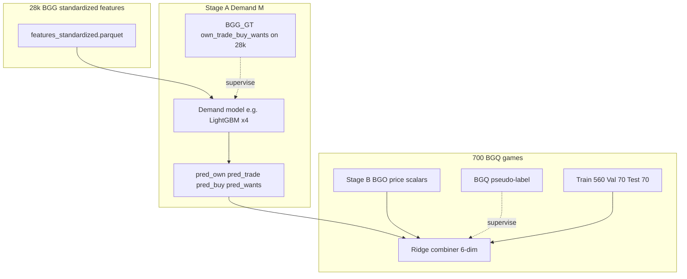

# Worth model pipeline — plan v2

This document is the **working spec** for the three-stage worth model. It complements [`PIPELINE_README.md`](../PIPELINE_README.md) and [`game_feature_export/README.md`](../game_feature_export/README.md).

---

## Dataset reality

| Pool | Role |
|------|------|
| **~28k BGG games** with full rows in **`features_standardized.parquet`** | **Stage A** training corpus (demand model **M**) |
| **700 BGQ-labeled games** (most with BGO price history) | **Stage C** supervised subset only (value combiner) |

**Stages A and C are independent supervised problems on different datasets.** Stage A is fit on the 28k corpus; Stage C uses **predictions from M** evaluated on the 700 games, plus price features and the BGQ pseudo-label.

---

## Architecture overview

```
┌─────────────────────────────────────────────────────────────┐
│  28k games: features_standardized.parquet                   │
│  tabular + reviewer aggregates + mean_embedding (384d)       │
└────────────────────────┬────────────────────────────────────┘
                         │
              ┌──────────▼──────────┐
              │   Stage A           │
              │   Demand model M    │  ← trained on all 28k
              │   → pred_own        │
              │   → pred_trade      │
              │   → pred_buy        │
              │   → pred_wants      │
              └──────────┬──────────┘
                         │ inference on 700 BGQ games
                         ▼
┌────────────────────────────────────────────────────────────┐
│  700 BGQ games only                                        │
│  [pred4]  +  [price scalars from BGO]  +  [BGQ label]     │
└────────────┬──────────────────────┬────────────────────────┘
             │                      │
   ┌─────────▼──────────┐  ┌───────▼────────────┐
   │   Stage B          │  │   Fixed splits      │
   │   Price features   │  │   on bgg_id         │
   │   hand-crafted     │  │   560 / 70 / 70     │
   └─────────┬──────────┘  └───────┬─────────────┘
             └──────────┬──────────┘
                        │
             ┌──────────▼──────────┐
             │   Stage C           │
             │   Value combiner    │  ← RidgeCV (or GridSearch), 6-dim input
             │   → predicted worth │
             └──────────┬──────────┘
                        │
             ┌──────────▼──────────┐
             │   Evaluation        │
             │   Spearman ρ        │
             │   vs 3 baselines    │
             └─────────────────────┘
```

### Mermaid (same pipeline, alternate view)



---

## Step 0 — Label audit (before any modeling)

BGQ scores are a **proxy**; know what they encode before fitting.

**Distribution.** Plot a histogram of BGQ scores across the 700 games. Heavy skew suggests a **rank transform** before fitting (e.g. `scipy.stats.rankdata`).

**Circularity.** If BGQ scores used the same **`mean_embedding`** that feeds Stage A, Stage C may partly recycle embedding signal. Quantify: Spearman between BGQ score and top PCA components of `mean_embedding`. If ρ > 0.4 on any component, document it and run a **price-only** Stage C ablation.

**Coverage.** Confirm most of the 700 have usable BGO history. Games with **fewer than 4** weekly price observations: set **`price_coverage = 0`**, impute **`log1p_last_mean = 0`** (or fixed sentinel), **do not drop** rows.

---

## Fixed splits (define once, serialize)

Split the **700** BGQ games by **`bgg_id`**, stratified on BGQ score quartile:

| Split | N | Purpose |
|-------|---|---------|
| Train | 560 | Fit Stage C combiner (and scaler for Stage C inputs) |
| Val | 70 | Tune α, feature checks |
| Test | 70 | **One-time** final metrics |

Persist to **`splits.json`** (lists of `bgg_id`). Do not relabel after tuning.

**Stage A** uses its **own** train/val split on the **28k** corpus (independent of 560/70/70).

---

## Stage A — Demand model (28k games)

### Inputs

Tabular BGG stats, reviewer aggregates, **`mean_embedding`** (384d, already processed by `preprocess.joblib`).

### Recommended default: LightGBM per target

Train **four** `LGBMRegressor` models (own / trade / buy / wants). Reduce embeddings with **PCA (32–64 components)** fit **on Stage A train only**, then `hstack` with tabular (+ reviewer) columns.

Targets: **`log1p(count)`**. Early stopping on Stage A **val** split. Report per-target **R²**, **MAE** on Stage A val (not on the 700).

**Upgrade** if val R² stalls (~0.5): two-branch MLP (tabular+review → 64→32, emb → 128→32 → concat → 4 heads), LayerNorm, Dropout(0.2), early stopping on mean val loss across targets.

### Inference

Always **`PreprocessBundle.transform`** for new games. Do **not** feed raw BGG counts as inputs at inference.

---

## Stage B — Price features (700 BGQ games)

No neural net in v2. Hand-crafted from **`price_histories/<BGO_KEY>.json`**, **`dt ≤ T`** (pick **T** as earliest BGQ label / collection cutoff to avoid leakage).

| Feature | Description |
|---------|-------------|
| `log1p_last_mean` | Primary scalar: most recent non-null weekly **mean** |
| `n_weeks_observed` | Weeks with non-null price |
| `price_slope_4w` | Slope over last 4 observed weeks |
| `price_vol` | Std of weekly means |
| `price_coverage` | 1 if ≥4 weeks observed, else 0 |

**Imputation:** no history → `log1p_last_mean = 0`, `price_coverage = 0`.

---

## Stage C — Value combiner (700 BGQ games)

### Input vector (6 dims)

```
[pred_own, pred_trade, pred_buy, pred_wants,
 log1p_last_mean, n_weeks_observed]
```

**Z-score** all six using **train-split** mean/std only; apply the same scaler to val and test.

### Model

**Ridge** with α tuned for **Spearman** alignment to the pseudo-label.

**Note:** `RidgeCV` in scikit-learn may use **default MSE-based** selection depending on version. To force Spearman-driven selection, use:

```python
from scipy.stats import spearmanr
from sklearn.linear_model import Ridge
from sklearn.model_selection import GridSearchCV
from sklearn.metrics import make_scorer

spearman_scorer = make_scorer(
    lambda y, yhat: spearmanr(y, yhat).statistic,
    greater_is_better=True,
)

combiner = GridSearchCV(
    Ridge(),
    param_grid={"alpha": [0.01, 0.1, 1.0, 10.0, 100.0]},
    scoring=spearman_scorer,
    cv=5,
)
combiner.fit(X_train_scaled, y_train)
```

Fit on **train** (560); choose hyperparameters using **val** (70) if you prefer a hold-out instead of CV on train; **evaluate test (70) once** at the end.

With **560** rows and a noisy label, **nonlinear** combiners (MLP, boosting) risk overfitting—stay with Ridge unless val Spearman is unusable; try **Elastic Net** before deep models.

### Ablation

Fit a second combiner on **`pred4` only** (no price). If val Spearman gain from adding price is **< 0.03 ρ**, consider dropping price complexity; if **> 0.05 ρ**, keep it.

---

## Evaluation protocol

### Primary metric

**Spearman ρ on the held-out test split (n=70).** Optional: bootstrap 95% CI (resample test rows with replacement, 1000 reps).

### Baselines (same test split)

| ID | Baseline | What it tests |
|----|----------|----------------|
| B1 | Predict global **mean** BGQ score | Any learnable signal |
| B2 | Ridge on **price features only** | Demand/pred4 marginal value |
| B3 | Ridge on **pred4 only** | Price marginal value |

The full 6-dim model should beat **B1–B3** on test ρ. If it beats B1/B2 but not **B3**, price features are not helping.

### Oracle (diagnostic only)

On **train**, refit Stage C replacing **`pred4`** with **ground-truth BGG four counts** where available; compare test Spearman to the production stack.

```
oracle_gap = ρ_oracle − ρ_model
```

| Gap | Interpretation |
|-----|----------------|
| < 0.05 | Stage A near ceiling for this label; improve label or Stage C |
| 0.05–0.15 | Room to improve demand model |
| > 0.15 | Stage A is the main bottleneck |

Never deploy oracle inputs (GT counts) for cold-start games.

### Results template

```
Model          | Val ρ | Test ρ | Test ρ 95% CI
---------------|-------|--------|---------------
B1 mean        |  —    |        |
B2 price-only  |       |        |
B3 pred4-only  |       |        |
Full 6-dim     |       |        |
Oracle (diag)  |  —    |        |
```

---

## Build order

Execute in order; do not skip validation.

1. **Label audit** — distribution, circularity, coverage  
2. **Fixed splits** — 560/70/70 → **`splits.json`**  
3. **Stage A** — fit on 28k; log val metrics per target  
4. **Baseline B1** — mean predictor on BGQ train; val Spearman  
5. **Stage B** — price scalars for all 700  
6. **Baseline B2** — price-only Ridge; val Spearman  
7. **Baseline B3** — pred4-only Ridge (using **M** outputs); val Spearman  
8. **Stage C** — full 6-dim combiner; tune α on train (and/or val)  
9. **Oracle** — GT demand swap; gap analysis  
10. **Test** — single report on 70 test ids + bootstrap CI  

---

## File touchpoints

| Artifact | Role |
|----------|------|
| [`game_feature_export/artifacts/embed_only/features_standardized.parquet`](../game_feature_export/artifacts/embed_only/features_standardized.parquet) | Stage A inputs (28k) |
| [`game_feature_export/artifacts/embed_only/preprocess.joblib`](../game_feature_export/artifacts/embed_only/preprocess.joblib) | Inference `transform` |
| [`price_histories/`](../price_histories/) | Stage B JSON |
| BGQ pseudo-label column | Stage C target (700 rows) |
| **`splits.json`** | Frozen train/val/test `bgg_id` lists |

Preprocess CLI: [`scripts/preprocess_features_parquet.py`](../scripts/preprocess_features_parquet.py).

---

## Intentionally out of scope for v2

- **Sequence / LSTM models** on BGO weekly series (hand-crafted scalars first).  
- **Nonlinear Stage C** unless n and signal justify it.  
- **End-to-end joint training** of Stage A + C (keep stages auditable).  
- **GT four counts** in any production Stage C path (oracle **diagnostic only**).

---

## Earlier notes (pseudo-labels, GridSearch)

Tuning optimizes **agreement with your proxy**, not objective economic truth. Prefer Spearman/Kendall for hyperparameter search; avoid repeated peeking at **test**. See also the section on **circularity** in Step 0 above.
