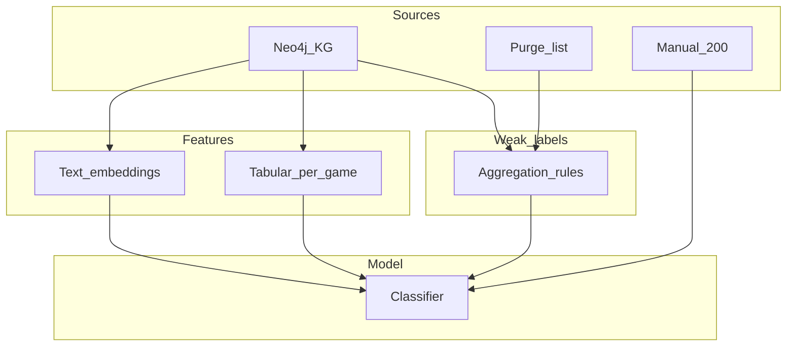

# Value-for-money metric: research and modeling plan

This document outlines how to define, supervise, and model a **value metric**: whether a board game is **worth the money** at a given market context, using distant supervision from user behavior, professional reviews (Board Game Quest), optional BGG purge data, a small gold set (~200 manual labels), and text embeddings.

It is grounded in this repository’s knowledge graph; see [neo4j/SCHEMA.md](neo4j/SCHEMA.md) and the CSV export pipeline in [kg_etl/export_csvs.py](kg_etl/export_csvs.py).

---

## 1. Problem formulation

**Target:** A game-level prediction of *value for money*—quality and enjoyment **relative to typical street price** (not “is this game good?” in isolation).

Pick one primary formulation:

| Formulation | Pros | Cons |
|-------------|------|------|
| **Binary** (`good_value` vs `not`) | Simple training and metrics | Loses nuance; threshold sensitive |
| **Ordinal (recommended for ~200 labels)** | 3–5 classes (e.g. poor / below average / fair / good / exceptional) | Needs clear rubric |
| **Regression** (0–100 score) | Fine-grained | Hard to calibrate with few annotators |

**Recommendation:** Start with **ordinal 5-class** labels on the manual set. If you need probabilities later, add **calibration** (Platt scaling or isotonic regression) on a held-out manual split.

---

## 2. Signals available in this project

| Signal | Graph / export source | Role |
|--------|------------------------|------|
| Market price | `(:PricePoint)` — `mean_price`, `min_price`, `max_price`, `date` | Cost side of value; normalize quality vs price |
| Professional review | `(:Review)` (BGQ) — `score`, `title`, body fields in `reviews.csv` | Quality prior + long-form text |
| Community text + rating | `(:BggReview)` — `comment_text`, `rating` | Weak sentiment / experience |
| Purchase / wishlist interest | `(:User)-[:WANTS_TO_BUY]->(:Game)`, `[:WANTS]->` | **Positive weak label** (interest / willingness to acquire) |
| Trade listing | `[:WANTS_TO_TRADE]` | **Ambiguous** (shelf clearing vs dissatisfaction) — use with care |
| Ownership + plays | `[:OWNS]` with `num_plays` | Engagement; optional mild positive or neutral |
| Game priors | `(:Game)` — `geek_rating`, `avg_rating`, `num_voters`, `complexity`, categories, mechanisms | Tabular features |

**Wishlist flag:** Raw `user/*_collection.jsonl` rows may include `wishlist` / `wishlist_priority`. Neo4j does not currently expose a dedicated `WISHLIST` relationship for every export path. **Optional data task:** extend [kg_etl/export_csvs.py](kg_etl/export_csvs.py) and load scripts to emit `WISHLIST` edges mirroring BGG, for a cleaner weak-positive signal than inferring from `want` alone.

---

## 3. Distant supervision (weak labels)

Weak labels are **noisy proxies** for value. Combine them with rules or generative models; validate only on **manual** data.

**Label inventory (examples; refine empirically):**

- **Positive interest (weak +):** Aggregate per `bgg_id`: counts of distinct users with `WANTS_TO_BUY` or `WANTS` (optionally log-scaled and capped). Interpret as *demand / interest* at roughly current market conditions.
- **Trade (weak ±):** `WANTS_TO_TRADE` counts — **down-weight** or gate (e.g. only with negative `BggReview` sentiment or very low `num_plays` on `OWNS`) to reduce “moving house” noise.
- **BGQ `score`:** High scores suggest quality; combine with price for a crude “quality per dollar” heuristic for pre-training or auxiliary loss (optional).
- **Purge list (BGG):** Often reflects **policy / listing violations**, not intrinsic game quality. **Default:** use as **exclusion filter** (drop from training or score as unknown). **Optional:** separate “listing risk” task, not value.

**Temporal leakage:** If collection snapshots have `last_modified`, align **price** to a window around that date when building weak labels; if only latest price exists, document that **labels and price may be misaligned** and run a sensitivity check.

---

## 4. Manual annotation (~200 games)

- **Stratified sampling** across: price deciles (or tertiles), `geek_rating` buckets, expansion vs base game, presence vs absence of BGQ review, and high vs low weak-label counts.
- **One-page guideline:** Define value **relative to typical street price** and expected enjoyment for a **stated persona** (e.g. “general hobbyist”) to reduce drift.
- **Reliability:** Double-annotate **~40** games; report **Cohen’s kappa** or **Krippendorff’s alpha** (ordinal).
- **Splits:** Reserve **40–50** games as a **locked test set**; use the rest for train/validation and model selection.

---

## 5. Features

### 5.1 Tabular (per `bgg_id`)

- Latest or rolling **mean** of `mean_price`, **log price**, year, `geek_rating`, `avg_rating`, `num_voters`, `complexity`, player/time summaries.
- **Categories / mechanisms:** one-hot, target encoding, or hashed features for high cardinality.

### 5.2 Text

- **Primary:** BGQ review **title + body** (concatenated).
- **Secondary:** Sampled / truncated `BggReview` comments (cap total characters or chunks per game).
- **Optional:** `Game.description`.

**Pooling:** Chunk long text → embed each chunk → **mean-pool** (or use model-specific pooling) into one vector per game.

---

## 6. Open-source fast embedding models

Use the **sentence-transformers** / **Hugging Face** stack. Licenses are typically Apache-2.0 or MIT; verify per model card before shipping.

| Model | Example checkpoint | Notes |
|-------|-------------------|--------|
| MiniLM | `sentence-transformers/all-MiniLM-L6-v2` | Very fast CPU/GPU, 384-d; strong English baseline |
| E5 small | `intfloat/e5-small-v2` | Fast; use `query:` / `passage:` prefixes as in model docs |
| BGE small | `BAAI/bge-small-en-v1.5` | Good speed/quality for English |
| GTE small | `thenlper/gte-small` | Compact general-purpose |
| Multilingual | `paraphrase-multilingual-MiniLM-L12-v2` | Heavier than L6; better for **non-English BGG comments** |

**Language strategy:** BGG text is often multilingual. Either **(a)** detect language and use a **multilingual** encoder, or **(b)** **English-only v1** with `langdetect` / fastText LID and drop or separate other languages.

**Throughput:** Batch encode with `sentence-transformers`; for deployment consider **ONNX** / **quantization** (`optimum`, or `fastembed` for lightweight inference). **FAISS** / **hnswlib** are optional if you need similarity search over games; a baseline classifier can use embeddings directly without ANN.

---

## 7. Modeling ladder

1. **Baseline:** Tabular only — **logistic regression** (ordinal: proportional odds or one-vs-rest) or **XGBoost / LightGBM**.
2. **Embeddings + tabular:** Concatenate `[z_text; x_tab]` or train a **small MLP** with two input branches (late fusion). Keep v1 simple.
3. **Noisy weak labels:** **Sample reweighting**, **confident learning** (cleanlab), or **Snorkel**-style generative weak supervision if you want explicit label sources.
4. **Phase 2 (heavier):** Fine-tune **DistilBERT** (or similar) on gold + weak data with a classification head; higher GPU cost.

---

## 8. Evaluation

- **Primary (manual gold):** Accuracy, **macro-F1**; for ordinal labels use **quadratic weighted kappa** between annotators and between model vs gold.
- **Calibration:** If you output probabilities, reliability curves and **Brier score**.
- **Error analysis:** By price band, expansion flag, and presence of BGQ review.
- **Weak-label diagnostics:** Precision/recall of rules on a **silver** subset only—**never** treat weak labels as ground truth.

---

## 9. Data flow

---

## 10. Implementation checklist (later PRs)

- [ ] Export a **flat table** (Parquet or CSV) keyed by `bgg_id`: join `Game`, latest (or windowed) `PricePoint`, aggregated user-intent counts, BGQ text fields, sampled `BggReview` text.
- [ ] Pin **embedding model id + revision** and **price snapshot date** in dataset metadata.
- [ ] Define **annotation schema** (JSON, Label Studio, or similar) and store **annotator instructions** in-repo.
- [ ] (Optional) Add `WISHLIST` relationship export from collection JSONL for cleaner weak positives.

---

## 11. References in this repo

- [neo4j/SCHEMA.md](neo4j/SCHEMA.md) — node/relationship definitions
- [kg_etl/export_csvs.py](kg_etl/export_csvs.py) — CSV fields for reviews and prices
- [scripts/build_neo4j_csvs.py](scripts/build_neo4j_csvs.py) — regenerating `neo4j/import/*.csv`
